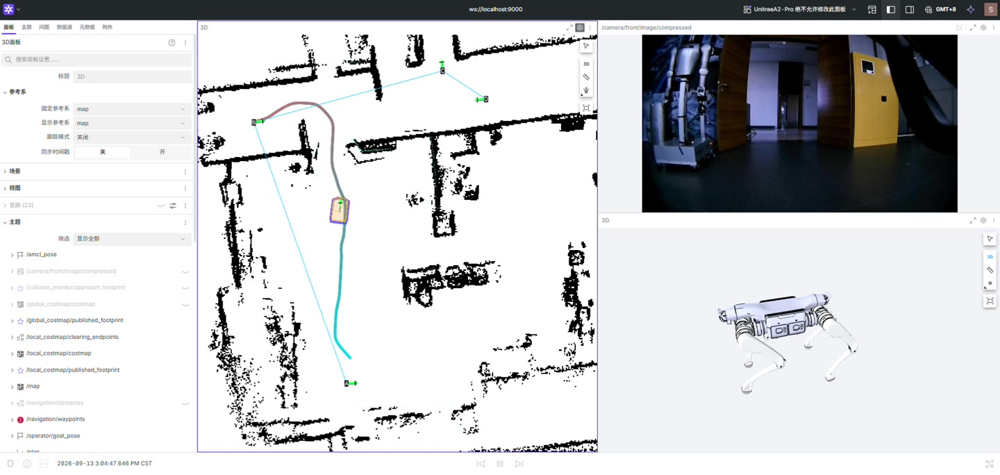
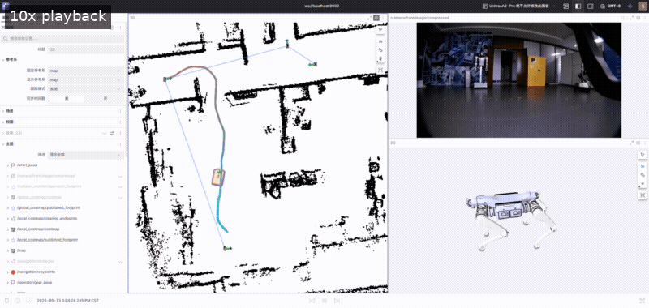

# 宇树四足机器人室内导航与多点巡逻

基于 ROS 2 Humble 的四足机器人导航工程，覆盖 **SLAM 建图 → 静态地图定位 → 点选目标 → 多点循环巡逻**。使用 Nav2、SLAM Toolbox、AMCL 和 Foxglove，包含 A2 运动接口、点云过滤、相机显示与运行记录工具。

[](https://github.com/lsclsc2026/u_robot_move/releases/download/v0.1.0-review/patrol-10x.mp4)

*点击封面观看巡逻演示（10 倍速）。这是实机运行的界面录制。*



| 演示 | 说明 | 视频 |
|---|---|---|
| 建图 | 激光地图逐步建立，前视相机与模型同步显示 | [10 倍速 MP4，约 33 秒](https://github.com/lsclsc2026/u_robot_move/releases/download/v0.1.0-review/mapping-10x.mp4) |
| 定位与打点 | 静态地图定位、界面交互与点位设置 | [3 倍速 MP4，约 44 秒](https://github.com/lsclsc2026/u_robot_move/releases/download/v0.1.0-review/localization-3x.mp4) |
| 多点巡逻 | 点位、路径与机器人前视画面 | [10 倍速 MP4，约 38 秒](https://github.com/lsclsc2026/u_robot_move/releases/download/v0.1.0-review/patrol-10x.mp4) |

视频是功能展示材料，不能替代对应代码版本的完整实机验收。[素材说明](docs/media.md)记录时长、来源。

## 功能

- **建图与地图管理：** SLAM Toolbox 手动建图，保存栅格地图和位姿图，可选地图清洗。
- **定位：** AMCL、初始位姿适配、TF/扫描匹配与定位质量诊断。
- **导航：** Smac 规划器、MPPI 控制器、实时障碍代价地图、重规划和恢复行为。
- **运动接口：** 速度平滑、死区整形、Collision Monitor、命令超时保护及独立控制开关。
- **巡逻：** A/B/C… 点位持久化，单次或循环任务，暂停、恢复、停止、失败重试和近距离后向目标处理。
- **可视化：** Foxglove 显示地图、激光、路径、点位、相机和机器人模型。
- **调试工具：** 只读预检、rosbag 录制、人工介入标记、轨迹分析，以及独立遥控接收器封装。

相机当前用于可视化与数据采集，不参与导航决策。项目针对室内平面导航，未提供楼梯通行、三维地形规划或视觉语义导航。

## 环境与目录

目标硬件为 Unitree A2 Pro。推荐 Ubuntu 22.04 / ROS 2 Humble / CycloneDDS，使用 [宇树机器人容器化开发环境](https://github.com/lsclsc2026/unitree_docker) 准备环境及固定版本的 SDK。

```text
unitree_robot_development/
├── sdk/                 # 固定版本第三方 SDK、ROS 消息和模型
├── u_robot_move/        # 本仓库
├── u_robot_audio/       # 可选，独立语音工程
└── u_robot_duck_dataset/ # 可选，采集与视觉实验工具
```

当前部署约定容器内路径为 `/home/unitree/unitree_robot_development`，数据位于 `/home/unitree/data`。部分配置和运维脚本使用该路径；改路径时需检查行为树、录制和遥控入口，详见[安装说明](docs/installation.md)。

## 快速开始

先按 Docker 仓库说明克隆项目、准备 SDK 并进入容器，再构建：

```bash
cd /home/unitree/unitree_robot_development/u_robot_move
./scripts/build.sh
source install/setup.bash
unset CYCLONEDDS_URI
./scripts/check_environment.sh
```

建图入口：

```bash
ros2 launch u_robot_mapping manual_mapping.launch.py
```

加载已保存地图、只运行定位：

```bash
ros2 launch u_robot_localization localization.launch.py \
  map:=/home/unitree/data/maps/site.yaml
```

导航预演：

```bash
ros2 launch u_robot_navigation navigation.launch.py \
  map:=/home/unitree/data/maps/site.yaml dry_run:=true
```

这三个顶层会话互斥。`site.yaml` 是需要自行建图保存的示例名称，仓库不附带适用于任意场地的地图。导航默认 `dry_run=true`；真实运动需要另外设置 `dry_run=false` 并启用驱动。请完整阅读[导航操作与停止方式](docs/navigation.md)，再进行实机操作。

在操作电脑转发 Foxglove 端口后连接 `ws://localhost:9000`。使用 `/operator/initialpose` 设置初始位姿，使用 `/operator/goal_pose` 下发单目标，使用 `/operator/waypoint` 添加巡逻点。各工具消息类型见 [Foxglove 配置](docs/foxglove.md)。

## 完整文档

| 文档 | 内容 |
|---|---|
| [安装与依赖](docs/installation.md) | 硬件输入、SDK、构建、目录、环境检查 |
| [系统架构](docs/architecture.md) | 包职责、TF、感知/定位/控制链路 |
| [建图与地图管理](docs/mapping.md) | 建图、保存、覆盖、清洗和查看 |
| [静态定位](docs/localization.md) | 初始位姿、AMCL、诊断和重定位 |
| [单目标导航](docs/navigation.md) | dry-run、目标检查、真实控制、取消和停止 |
| [多点巡逻](docs/patrol.md) | 打点、路线保存、循环、暂停和重试 |
| [Foxglove](docs/foxglove.md) | SSH、地图/相机/模型面板、写入接口 |
| [参数与接口](docs/configuration.md) | 关键配置默认值、单位和话题 |
| [遥控模块](docs/teleop.md) | 接收器包装、互斥锁、PC1 接口及缺失源码说明 |
| [记录与验证](docs/validation.md) | 离线检查、实机测试记录方法与当前限制 |
| [故障排查](docs/troubleshooting.md) | DDS、TF、定位、规划、点云、相机 |
| [展示素材](docs/media.md) | 视频下载、截图、压缩方法 |
| [来源与第三方依赖](THIRD_PARTY.md) | SDK、模型、接收器二进制和许可状态 |

## 发布状态

本版为 `v0.1.0-review` 私有审阅版，整理自现有 A2 工程。发布整理保留当前导航参数与控制保护，不针对演示地图修改算法。[验证记录](docs/validation.md)区分本次离线检查与待完成的实机验收，已知定位漂移、近障恢复和连续巡逻表现仍需结合现场记录评估。

相关项目：[开发环境](https://github.com/lsclsc2026/unitree_docker) · [语音播报](https://github.com/lsclsc2026/u_robot_audio) · [鸭子数据与视觉工具](https://github.com/lsclsc2026/u_robot_duck_dataset)。
