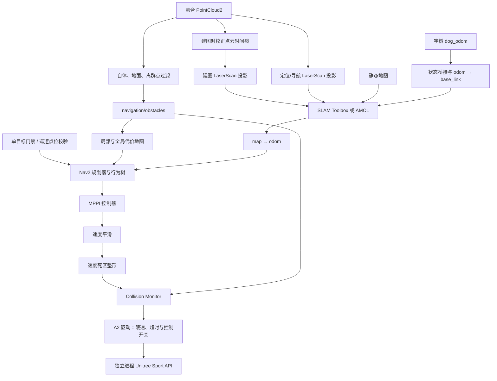

# 系统架构

## 数据与控制链路

导航速度链为 `/cmd_vel_nav → /cmd_vel → /cmd_vel_shaped → /cmd_vel_safe`。导航驱动只订阅最后一级，巡逻节点通过 Nav2 Action 请求目标，不直接输出速度。

`map → odom` 来自 SLAM 或 AMCL；`odom → base_link` 来自状态桥接；机体、腿部和传感器 TF 来自模型及关节桥接。建图与静态定位不能同时竞争发布同一 TF。

LaserScan 与障碍过滤是两条并行支路：当前定位/导航的 scan 默认直接投影融合点云，建图先通过 `/mapping/points_time_aligned` 校正时间戳再投影。`/navigation/obstacles` 默认只供代价地图和 Collision Monitor 使用，调整自体障碍过滤不会自动改变 AMCL/SLAM 的 scan。

## 包职责

| 包 | 职责 |
|---|---|
| `u_robot_bringup` | 基础入口与顶层会话互斥 |
| `u_robot_a2_driver` | 速度保护、运动锁、原生 Sport API 后端 |
| `u_robot_state_bridge` | 里程计、TF、原生关节状态到 ROS 消息 |
| `u_robot_description` | 官方 A2 URDF/mesh 包装和显示 |
| `u_robot_perception` | 点云时间处理、自体/地面/离群点过滤及 LaserScan |
| `u_robot_mapping` | SLAM Toolbox、栅格与位姿图保存 |
| `u_robot_localization` | map server、AMCL、初始位姿适配、定位质量诊断 |
| `u_robot_navigation` | Nav2 参数、目标门禁、行为树与速度整形 |
| `u_robot_patrol` | 点位保存、任务状态、循环与失败重试 |
| `u_robot_observability` | Foxglove 桥接及操作接口白名单 |
| `u_robot_camera_bridge` | H.264/RTP 解码，输出压缩相机话题 |
| `u_robot_teleop` | 原有遥控接收器封装、进程监督与运动互斥 |

语音在独立 [宇树机器人语音播报系统](https://github.com/lsclsc2026/u_robot_audio) 工作区；Foxglove 可以暴露其受限操作接口，但导航不要求语音节点存在。

## 算法选择

常规规划首先使用 `SmoothForward`（SmacPlanner2D），失败后尝试 `TightRecovery`（Hybrid/Reeds–Shepp）和 `GridRecovery`。MPPI 采用 DiffDrive 运动模型进行采样；这属于本工程控制配置，不代表 A2 硬件无法横移。

近距离且位于机体后方的巡逻目标可选择专用 `ReverseApproach` 规划器、`ReversePath` 控制器和后向行为树。常规路径及异常恢复仍使用同一代价地图和运动保护链路。

行为树按路径有效性重规划，并在失败时尝试短距离后退、前进或清理代价地图。清理代价地图不能消除持续存在的真实障碍。具体节点和距离见 `src/u_robot_navigation/behavior_trees/`。

## 感知与显示边界

动态腿部自体过滤依赖实时关节 TF，缺失时障碍点云可能无法满足健康条件。高度过滤针对平面室内场景，低矮目标、玻璃、反射和特殊材质不能假定可靠检测。

当前安装的相机节点是 Python/OpenCV/GStreamer 实现，输出 960×540 JPEG，质量 82，最高 15 Hz。仓库保留的额外相机 C++ 源码未被当前 CMake 编译或安装，不应当作运行后端。相机和三维模型用于观测，不参与路径规划。
