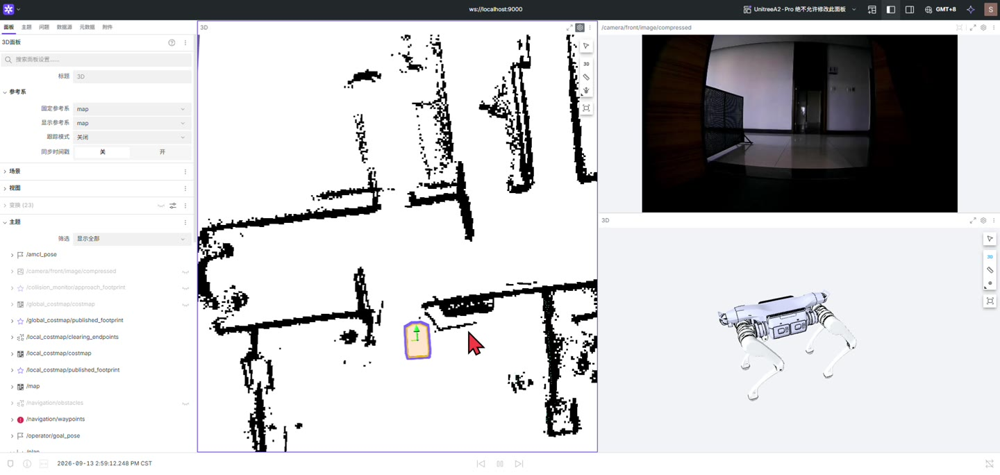

# 静态地图定位



## 启动

```bash
source /home/unitree/unitree_robot_development/u_robot_move/install/setup.bash
ros2 launch u_robot_localization localization.launch.py \
  map:=/home/unitree/data/maps/site.yaml
```

该入口包括地图、AMCL、感知、状态、相机和 Foxglove，不加载运动驱动或 Nav2 控制器。它与建图、导航及其他顶层显示会话互斥。

## 设置初始位置

Foxglove 当前桥接白名单允许 `/operator/initialpose`。将 3D 面板固定参考系设为 `map`，使用 **2D Pose** 工具，以 `geometry_msgs/msg/PoseStamped` 向该话题发送机器人真实位置与朝向。`initial_pose_adapter` 加入协方差后发布到 AMCL 的 `/initialpose`。

普通 ROS 客户端仍可直接向 `/initialpose` 发送 `PoseWithCovarianceStamped`；但浏览器不应假定该话题在本项目白名单中。旧交接说明中的默认 `/initialpose` 点击流程已经被此适配方式替代。

只有坐标已经测量确认时，才使用参数预设：

```bash
ros2 launch u_robot_localization localization.launch.py \
  map:=/home/unitree/data/maps/site.yaml \
  set_initial_pose:=true initial_pose_x:=1.0 initial_pose_y:=2.0 initial_pose_yaw:=0.0
```

这些数字仅说明参数语法，不代表任何实际场地起点。默认 `set_initial_pose=false`。

## 判断是否可信

- 观察激光墙面与地图是否对齐，机体位置和朝向是否符合现场。
- 检查 `/amcl_pose`、`map → odom → base_link` 和 `/diagnostics`。
- `/localization/scan_alignment` 提供扫描匹配分数，`/localization/quality_ok` 提供质量状态。
- AMCL 不保证静止时持续高频发布位姿；不能单凭一小段时间未收到新消息就判定定位丢失。

默认巡逻的 `require_localization_quality=false`，质量话题是辅助诊断，不是每一步巡逻的硬停止开关。动态人员、开关门和家具变化会影响静态地图对齐分数；单目标门禁另有协方差、TF 和点云条件。

## 常见问题

位姿发生跳变、墙面错位或反复漂移时，先检查使用的地图、初始姿态、时间戳、里程计与 TF，再检查传感器和现场变化。不要用持续手动拖动位姿掩盖原因。进入真实导航前应在当前场地验证定位稳定性，详见[验证记录](validation.md)。
