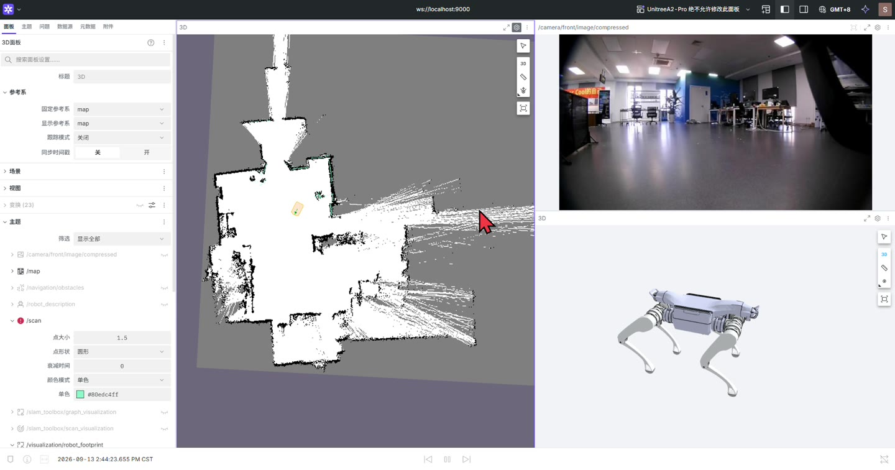

# 建图与地图管理



## 建图

在构建并加载工作区后：

```bash
ros2 launch u_robot_mapping manual_mapping.launch.py
```

此入口运行建图和显示，不启动 A2 导航运动驱动。移动机器人需要操作者使用已有人工控制方式。保持激光、里程计、TF 数据连续，观察地图中的墙面是否重复、弯曲或错位；地图失真时应先处理输入与定位关系。

Foxglove 默认监听 `127.0.0.1:9000`。左侧 3D 面板使用 `map` 参考系，显示 `/map`、`/scan` 与机器人 footprint；相机和模型分别使用独立面板。

## 保存

在第二个容器终端加载工作区后：

```bash
ros2 run u_robot_mapping save_map.sh site
```

也可指定已有可写目录：

```bash
ros2 run u_robot_mapping save_map.sh site /home/unitree/data/maps
```

输出包括 `site.yaml`、`site.pgm`、`site.posegraph` 和 `site.data`。栅格地图用于 AMCL/Nav2，位姿图保存 SLAM 数据供后续编辑用途。保存脚本检查 `/map` 唯一发布者是 SLAM Toolbox，并检查服务与地图数据。

**同名保存会删除并覆盖现有地图相关文件。** 保留旧版时使用新名字；脚本不是事务性备份工具，保存完成后应核对文件存在、YAML 图片路径和地图显示。位姿图文件不由 AMCL 使用。

## 可选清洗

`prepare_navigation_map.py` 对自由区域做保守形态学处理，将细长的自由空间条纹转成未知，不把占用或未知区域变成自由区域：

```bash
python3 scripts/prepare_navigation_map.py \
  --source-yaml /home/unitree/data/maps/site.yaml \
  --output-prefix /home/unitree/data/maps/site_clean
```

输出已存在时拒绝覆盖。算法针对常见 ROS PGM 编码，不应直接用于任意像素编码的地图。另有 `clean_occupancy_map.py` 提供其他清洗选项，先查看 `--help`，并人工比较处理前后地图。

清洗后的栅格与原始 SLAM 位姿图用途不同，不将其描述为位姿图已经同步修改。

## 查看与进入定位

停止建图，再查看保存地图：

```bash
ros2 launch u_robot_mapping view_saved_map.launch.py \
  map:=/home/unitree/data/maps/site.yaml
```

检查地图轮廓和比例后，停止查看会话，按[静态定位](localization.md)加载地图。仓库中的空地图测试 fixture 仅用于测试，不能用于真实导航。
